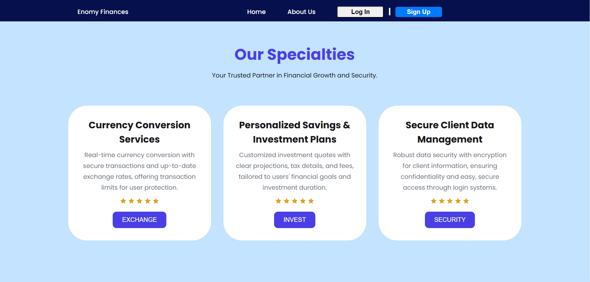
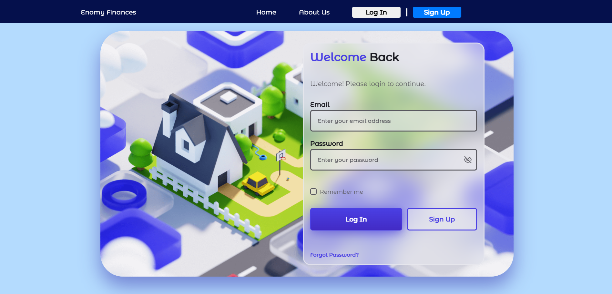
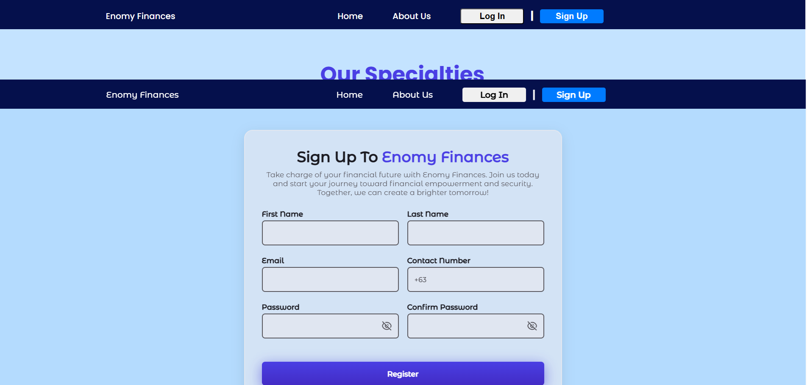

Finance Website

The Finance Website is a web-based financial management system designed to enhance user experience, streamline financial calculations, and securely store user data. It supports core services such as currency conversion, savings, and investment planning while ensuring scalability for future growth.

Key Features

Currency Conversion – Real-time exchange rate calculations with tiered transaction fees.

Savings & Investments – Personalized investment quotes for different financial plans.

Security & Data Management – Secure authentication, encrypted storage, and data caching.

Scalability & Performance – Optimized system capable of handling increased user traffic.

User-Friendly Interface – Intuitive design for easy navigation and financial analysis.

This project aims to transition from a desktop-based system to a modern, accessible web platform for seamless financial management.

HOMEPAGE:

LOGIN PAGE:

SignUp PAGE:

